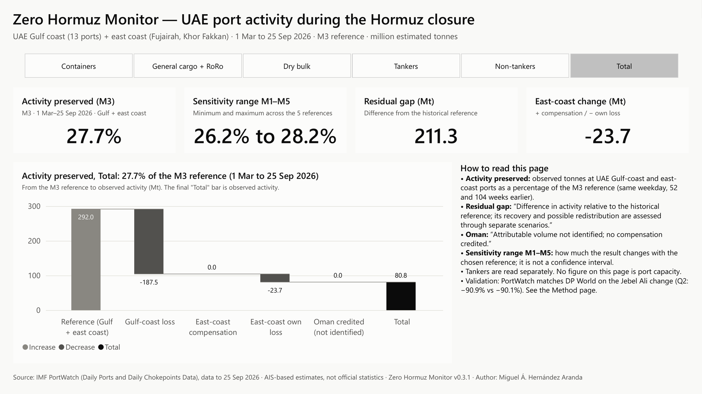
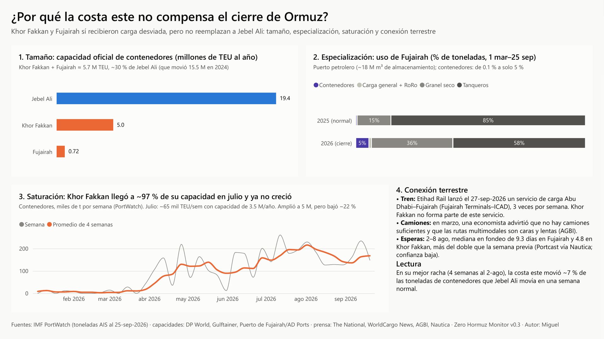
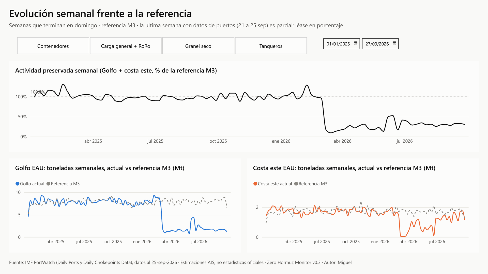
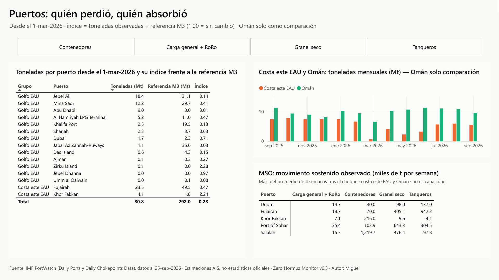
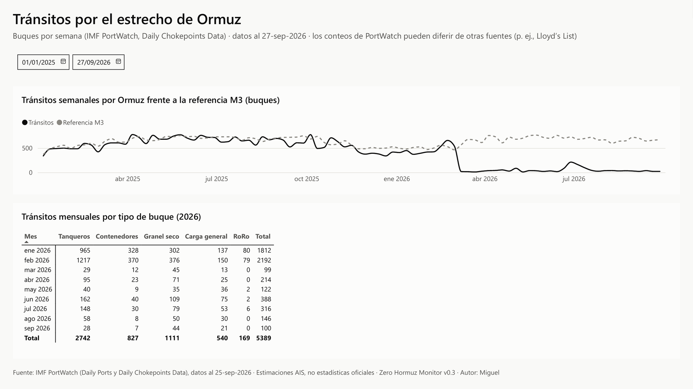
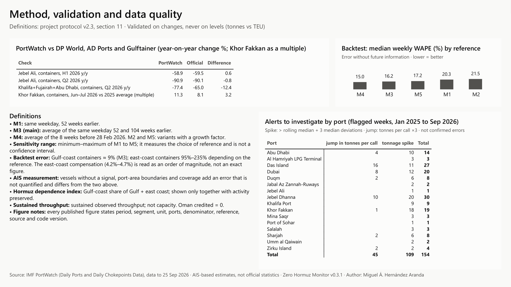

# Zero Hormuz Monitor

**How much UAE port activity survived the 2026 closure of the Strait of Hormuz, and could the east-coast ports make up the difference?**

An open, reproducible data pipeline (Python → SQLite → Excel) and a six-page Power BI dashboard built on IMF PortWatch vessel-tracking (AIS) estimates. It compares UAE port activity from 1 March to 25 September 2026 with a historical reference (the same weeks of previous years) and tests whether Fujairah and Khor Fakkan, outside the strait, compensated for the Gulf-coast ports.



> Version 0.3.1 · data through 25 Sep 2026 (PortWatch, retrieved 3 Oct 2026, frozen in [`data/snapshot_2026-10-03/`](data/snapshot_2026-10-03/)).
>
> **Executive summary (2 pages):** [`docs/ZeroHormuz_Executive_Summary_v0.3.1.pdf`](docs/ZeroHormuz_Executive_Summary_v0.3.1.pdf)
>
> The dashboard is published in English ([`ZeroHormuz_Monitor_EN.pbix`](powerbi/ZeroHormuz_Monitor_EN.pbix)) and in its original Spanish ([`ZeroHormuz_Monitor.pbix`](powerbi/ZeroHormuz_Monitor.pbix)). Figures, structure and design are identical; table names, measure names and code comments are in Spanish.

---

## Key findings (1 Mar – 25 Sep 2026)

| Indicator | Result | Range across 5 reference methods |
|---|---|---|
| UAE port activity preserved, all cargo (tonnes) | **27.7 %** of the historical reference | 26.2 – 28.2 % |
| UAE container activity preserved | **16.1 %** | 14.5 – 16.2 % |
| Gulf-coast container loss offset by the east coast | **4.2 %** (order of magnitude, see [Uncertainty](#uncertainty)) | 4.2 – 4.7 % |
| East coast, all cargo | **−23.7 Mt** (own loss, mainly in Fujairah's tanker segment) | no net compensation under any method |
| Gap vs the historical reference, all cargo | **211.3 Mt** | 205.9 – 227.0 Mt |

The gap is the difference in activity relative to the historical reference; its recovery and possible redistribution are assessed through separate scenarios. It does not measure unmet demand or required capacity.

**Validation against official figures.** PortWatch tonnes track official TEU changes closely for Jebel Ali containers: Q2 2026 year on year **−90.9 %** (PortWatch) vs **−90.1 %** (DP World); H1 2026 **−58.9 %** vs **−59.5 %**. Results are validated on percentage changes, not on absolute levels.

### Why the east coast cannot replace Jebel Ali



1. **Size.** Container capacity declared by the operators: Khor Fakkan 5.0 M TEU + Fujairah 0.72 M TEU = 5.72 M TEU, about **30 %** of Jebel Ali's 19.4 M TEU.
2. **Specialization.** Fujairah is an oil and bulk port. Share of its tonnes, Mar–Sep 2025: 85.0 % tankers, 14.8 % dry bulk, 0.1 % containers. In 2026 containers rose only to **5.3 %**.
3. **Pace vs declared capacity.** In July Khor Fakkan handled about 65,000 TEU a week (operator figure), a pace equal to about 97 % of its declared 3.5 M TEU a year. This is a ratio of pace to declared capacity, not measured occupancy. Its 4-week container average peaked at 216.0 kt (week to 2 Aug) and then fell **22 %** to 168.0 kt, despite an expansion to 5 M TEU. The cause of the decline is not identified (see [What the data cannot prove](#what-the-data-cannot-prove-and-why)).
4. **Land connection.** Etihad Rail started an Abu Dhabi–Fujairah freight service on 27 Sep 2026, three times a week; Khor Fakkan is not served. In March the press reported a shortage of trucks and costly, slow multimodal routes, and in early August anchorage waits of 9.3 days at Fujairah and 4.8 at Khor Fakkan (low confidence).

At its best 4-week run, the whole east coast moved about **7 %** of the container tonnes Jebel Ali handled in an average pre-closure week (January 2025 – February 2026).

**Evidence levels.** Points 1–4 and the 7 % are measured findings with a source. That Khor Fakkan's decline reflects operating limits, or that land links limit what the east coast can serve, are hypotheses not tested here.

---

## Method

**Data.** Daily port-call and cargo-volume estimates for 18 port areas (13 on the UAE Gulf coast, Fujairah and Khor Fakkan on the east coast, and Sohar, Salalah and Duqm in Oman), plus daily Strait of Hormuz transits, downloaded from the IMF PortWatch open ArcGIS API.

**Segments.** Containers · General cargo + RoRo · Dry bulk · Tankers · Non-tankers · Total.

**Historical reference.** Five baselines, so every headline number comes with a sensitivity range:

| Code | Baseline |
|---|---|
| M1 | Same weekday 52 weeks earlier (364-day lag) |
| M2 | M1 adjusted for pre-shock growth (sensitivity only) |
| **M3** | **Average of the same weekday 52 and 104 weeks earlier (main reference)** |
| M4 | Average level of the 8 weeks before the shock (28 Feb 2026) |
| M5 | M3 adjusted for pre-shock growth (sensitivity only) |

**Indicators.**

- *Activity preserved* = (Gulf-coast actual + east-coast actual) ÷ (Gulf-coast reference + east-coast reference).
- *Gap decomposition*: (a) Gulf-coast loss, (b) east-coast compensation or own loss, (c) Oman credited (kept at 0 until there is evidence of diverted UAE cargo), (d) residual gap, i.e. the difference in activity relative to the historical reference.
- *Alerts*: weekly spikes above a 26-week rolling median + 3 median absolute deviations, and jumps in tonnes per port call. They flag weeks to investigate; they are not confirmed errors.

**Backtest without future information.** Each baseline was tested on three windows before the shock (Mar–Sep 2024, Mar–Sep 2025, Dec 2025–Feb 2026). Median weekly WAPE across groups and segments: M4 15.0 % · M3 16.2 % · M5 17.2 % · M1 20.3 % · M2 21.5 %.

### Uncertainty

Three different sources of uncertainty are kept apart:

1. **Choice of reference (sensitivity range).** The ranges in the tables are the minimum and maximum across M1–M5. They show how much a result depends on the baseline; they are not confidence intervals.
2. **Backtest error of the reference.** For Gulf-coast containers, the segment that drives the headline, M3 averages a weekly WAPE of 9.1 %. For east-coast containers the error is far larger: 95 % to 235 % depending on the baseline (mean of the three windows). The east-coast compensation share (4.2–4.7 %) is therefore read as an order of magnitude, not as a precise decimal. What holds under every baseline: the east coast offset less than 5 % of the Gulf-coast container loss, and across all cargo it shows no net compensation.
3. **AIS measurement and coverage.** Vessels without a signal, port-area boundaries and transshipment adjustments add an error that is not quantified here and is separate from the two above.

**Known limitations.**

- All PortWatch volumes are AIS-based **estimates**, not customs records.
- PortWatch records fewer Hormuz transits than Lloyd's List (31 vs 73 in the week of 10–16 Aug 2026), so transits are used for trend only.
- Isolated spikes (e.g. Abu Dhabi in March and June 2026) may be vessels anchored inside the port area.
- The monitor measures cargo that moved, not unmet demand or the capacity that would have been needed.

### What the data cannot prove, and why

Five questions stay open. For each one: why PortWatch cannot answer it, and what evidence would.

- **Why Khor Fakkan declined after early August (−22 %).** PortWatch records how much cargo moved, not why. The same series fits several explanations that the data cannot separate: congestion or operating limits, shipping lines moving services to other ports, lower demand, vessels waiting outside the PortWatch port area, road-haulage limits towards the rest of the UAE, or an AIS measurement effect. Saturation alone does not explain it, because the decline came after the expansion to 5 M TEU. *What would settle it:* carrier service schedules (services added to or dropped from Khor Fakkan), vessel waiting and anchorage times, monthly TEU and operating data from Gulftainer, and truck flows out of the east coast.
- **Actual port occupancy.** Occupancy is measured with operating data that only the operator holds: berth hours used vs available, boxes in the yard vs yard capacity, crane moves and gate traffic. PortWatch estimates tonnes from vessel draught; it gives no TEU, berthing times or yard use. Published capacity is nameplate; effective capacity depends on cargo mix, berth windows and productivity. That is why the 97 % above is pace vs declared capacity, not occupancy. *What would settle it:* operator reports on berth and yard occupancy or, as a proxy, vessel waiting times.
- **Size of the AIS measurement error.** Measuring an error needs a true value at the same level of detail, and none exists. Official figures are quarterly or half-yearly, per operator (whose terminals do not match PortWatch port areas) and in TEU; PortWatch gives daily tonnes per port area. That allows comparing changes (Jebel Ali Q2: −90.9 % vs −90.1 %), not weekly levels. Vessels with AIS switched off or with altered signals, more common in conflict zones, leave no record to count. The backtest WAPE measures the error of the reference, not of the measurement. *What would settle it:* official monthly port statistics in tonnes, or a second AIS or satellite source to compare against.
- **Diversion of UAE cargo to Oman.** PortWatch records cargo entering and leaving each port, not its origin or final destination. A rise at Sohar could be Omani demand, Saudi cargo, transshipment or goods later trucked into the UAE; the data cannot tell them apart. Oman's container difference (−4.9 to +5.7 Mt across M1–M5, `oman_dif_no_acreditada_Mt` in `cumulative_summary.csv`) also stays within its normal week-to-week noise. *What would settle it:* a post-28 Feb break above that noise by segment and direction, documented diverted services, a customs corridor, border truck counts, or official transit statistics to the UAE.
- **Unmet demand and required capacity.** The gap is measured against the historical reference (the same weeks of 2024 and 2025), not against what the UAE would have needed in 2026. It mixes things the data cannot separate: demand that fell because of the conflict itself (prices, insurance, activity), cargo that arrived by other routes (air, road via Saudi Arabia or Oman, Omani ports), purchases postponed or covered from inventory, and demand that went unserved. Only the last one is unmet demand. *What would settle it:* official imports by transport mode and origin, inventories and prices of key goods, and land trade by border crossing.

---

## Dashboard (Power BI)

| Page | Content |
|---|---|
| 1 · Summary | Activity preserved, sensitivity range, residual gap, east-coast change, and a waterfall from the reference to observed activity |
| 2 · Weekly | Weekly activity preserved; Gulf coast and east coast, actual vs reference |
| 3 · Ports | Who lost and who absorbed: port matrix, monthly east coast and Oman tonnes, sustained weekly throughput |
| 4 · Hormuz | Weekly transits through the strait vs reference, and monthly transits by vessel type |
| 5 · Method | Validation against official figures, backtest WAPE by reference (M1–M5), definitions, uncertainty and data-quality alerts |
| 6 · Why not replace? | Size, specialization, pace vs declared capacity, and land connection |

<details>
<summary>Screenshots of pages 2–5</summary>






</details>

The full dashboard is also available as a PDF: [English](docs/ZeroHormuz_Monitor_EN_v0.3.1.pdf) · [Spanish](docs/ZeroHormuz_Monitor_v0.3.1.pdf). Spanish screenshots are in [`docs/images/es/`](docs/images/es/).

**Model.** Star schema with 15 tables (date, port and segment dimensions; daily port and Hormuz facts; summary tables) and 36 DAX measures. The semantic model is stored as TMDL in [`powerbi/semantic-model/`](powerbi/semantic-model/) so measures and relationships can be read and diffed as text.

---

## Repository structure

```
zero-hormuz-monitor/
├── src/zero_hormuz_monitor.py            # pipeline: PortWatch API → SQLite → indicators → Power BI package
├── requirements.txt
├── data/snapshot_2026-10-03/             # frozen PortWatch download behind every published figure: CSVs, queries (README) and SHA256SUMS
├── outputs/                              # results at the 25-Sep-2026 cut-off
│   ├── SHA256SUMS                        # hashes of the seven result CSVs
│   ├── cumulative_summary.csv            # preserved activity and gap decomposition, M1–M5
│   ├── weekly_indicators.csv             # weekly actual vs reference by group × segment
│   ├── validation.csv                    # PortWatch vs DP World, AD Ports, Gulftainer
│   ├── backtest_wape.csv                 # out-of-sample test of the baselines
│   ├── alerts.csv · hormuz_weekly.csv · monthly_east_oman.csv
│   └── powerbi/ZeroHormuz_PowerBI.xlsx · ZeroHormuz_PowerBI_EN.xlsx   # star-schema tables feeding the dashboards
├── powerbi/
│   ├── ZeroHormuz_Monitor_EN.pbix · ZeroHormuz_Monitor.pbix          # ready to open (data included)
│   ├── ZeroHormuz_Monitor_EN_PBIP.zip · ZeroHormuz_Monitor_PBIP.zip  # Power BI Projects (PBIR report + TMDL model)
│   ├── ZeroHormuz_theme.json
│   └── semantic-model/                   # TMDL: model, parameter, relationships, tables and measures
└── docs/
    ├── ZeroHormuz_Executive_Summary_v0.3.1.pdf
    ├── ZeroHormuz_Monitor_EN_v0.3.1.pdf · ZeroHormuz_Monitor_v0.3.1.pdf
    └── images/                           # page screenshots (English; Spanish in images/es/)
```

## Reproduce the published cut

This procedure rebuilds the figures of version 0.3.1 from the frozen download, without contacting PortWatch. The exact API queries, row counts and hashes of the download are documented in [`data/snapshot_2026-10-03/README.md`](data/snapshot_2026-10-03/README.md).

```bash
git clone https://github.com/mhzamx/zero-hormuz-monitor.git
cd zero-hormuz-monitor
pip install -r requirements.txt
(cd data/snapshot_2026-10-03 && sha256sum -c SHA256SUMS)
python src/zero_hormuz_monitor.py --data-dir data/snapshot_2026-10-03 --out-dir outputs_repro --powerbi
(cd outputs_repro && sha256sum -c ../outputs/SHA256SUMS)
```

The seven CSV files in `outputs_repro/` match `outputs/SHA256SUMS` byte for byte (checked on 4 Oct 2026). The Excel file is rebuilt with the same tables; its file hash changes on every run because of internal timestamps. `--refresh` is refused together with `--data-dir`, so the snapshot cannot be overwritten. On Windows, use `Get-FileHash -Algorithm SHA256` to compare hashes.

## Weekly update (new cut)

PortWatch updates on Tuesdays. A new download is a new cut, with new figures; it does not replace the frozen one.

```bash
python src/zero_hormuz_monitor.py --refresh --powerbi
```

- `--refresh` downloads fresh data into `data/` (not tracked by git). Later runs without it reuse those CSVs.
- `--powerbi` also writes `outputs/powerbi/ZeroHormuz_PowerBI.xlsx`.

## Power BI

Open `powerbi/ZeroHormuz_Monitor_EN.pbix` (or the Spanish `ZeroHormuz_Monitor.pbix`) with Power BI Desktop; the data are included.

To work with the project version, unzip `ZeroHormuz_Monitor_EN_PBIP.zip` (or the Spanish zip) and open the `.pbip` file. All tables read one Excel file through the parameter **RutaExcel**: in Power BI Desktop go to *Home → Transform data → Edit parameters*, set RutaExcel to the full path of your copy of `outputs/powerbi/ZeroHormuz_PowerBI_EN.xlsx` (or `ZeroHormuz_PowerBI.xlsx` for the Spanish project), and select *Refresh*.

## Tools

Python (pandas, NumPy, requests) · SQLite · Excel · Power BI Desktop (Power Query, DAX, star schema, PBIP / TMDL / PBIR) · IMF PortWatch API

## Sources and data terms

- **Volumes and transits:** [IMF PortWatch](https://portwatch.imf.org) (AIS-based estimates). Source: International Monetary Fund, PortWatch. IMF data may be reused and redistributed for non-commercial purposes with attribution; commercial reuse requires IMF permission ([IMF copyright and terms](https://www.imf.org/en/about/copyright-and-terms)).
- **Validation:** DP World H1 2026 results; AD Ports Q2 2026 results; Gulftainer figures reported by The National (7 Jul 2026).
- **Capacities (declared by operators):** DP World (Jebel Ali), Gulftainer (Khor Fakkan), Port of Fujairah / AD Ports (Fujairah).
- **Context:** The National, WorldCargo News, AGBI, Nautica / Portcast.

The MIT license applies to the code only, not to the PortWatch data in `data/` and `outputs/`. This is an independent analysis. It is not affiliated with or endorsed by the IMF or any port operator, and all PortWatch figures are estimates.

## Author

**Miguel Ángel Hernández Aranda** · Data analyst, logistics and supply chain<br>
GitHub [@mhzamx](https://github.com/mhzamx) · mhzamx@outlook.com
